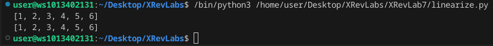
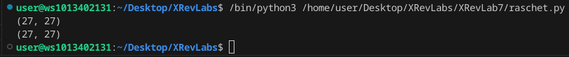

# Лабораторная работа №7
### Задание
        Напишите две функции для решения задач своего варианта - с использованием рекурсии и без.
        Оформите отчёт в README.md. Отчёт должен содержать:
            Условия задач
            Описание проделанной работы
            Скриншоты результатов
            Ссылки на используемые материалы

    Вариант 8:

        Функция для линеаризации вложенных списков

    >>> linearize([1, 2, [3, 4, [5, [6, []]]]])
    [1, 2, 3, 4, 5, 6]

        Функция для расчёта ak=2bk−1+ak−1;bk=2ak−1+bk−1 a_k = 2 b_{k-1} + a_{k-1}; b_k = 2 a_{k-1} +b_{k-1} ak​=2bk−1​+ak−1​;bk​=2ak−1​+bk−1​. a1=b1=1 a_1 = b_1 = 1 a1​=b1​=1.

### Описание проделанной работы
Написал программы по варианту 8
Оформил отчёт в файле readme.md

#### Инструкция по запуску
1. Открыть папку XRevLab7 с помощью VSCodium
2. Вызвать консоль и прописать `gcc linearize/raschet.c -o result` 
3. прописать в консоли `./result` 

### Вывод программы
## lin

## ras

### Ссылки
1. https://evil-teacher.on.fleek.co/prog_pm/term1/lab03/